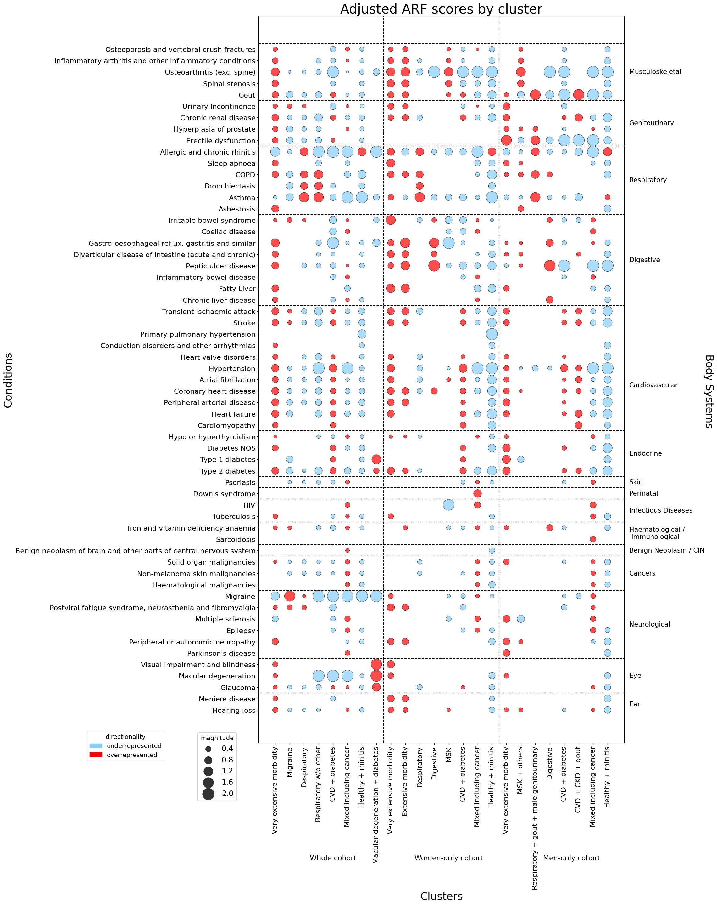

# A Systematic Clustering Analysis for Binary Multimorbidity Data

This is the code repository corrresponding to the systematic clustering analysis within our article, "Investigating associations between physical multimorbidity clusters and subsequent depression: cluster and survival analysis of UK
Biobank data" (preprint out soon).

---

## Introduction

Perform a systematic clustering analysis which explores four different approaches upon your binary data.

You can also visualize your results using adjusted relative frequencies on a bubble heatmap:

 

:arrow_right: Jump to [**Visualization Section**](#vis)

 

---

## Installation

To begin, create a Python environment and install the package.

Clone and navigate to the repository:

    git clone https://github.com/laurendelong21/clusterMed.git
    cd clusterMed

create and activate a Python environment (replace `$ENV_NAME$` with your desired environment name):

either **with venv**:

    python3 -m venv $ENV_NAME$
    source $ENV_NAME$/bin/activate

or **with conda** (choose python>=3.7):

    conda create --name $ENV_NAME$ python=3.7
    conda activate $ENV_NAME$

 and install the `clustr` package:

    pip install .

 

---

## Usage

 

### File format

This package operates upon [tab-separated files](https://en.wikipedia.org/wiki/Tab-separated_values) (.tsv).

- The column names should indicate the conditions.

- The rows should denote participants. The first column should be the patient ID (or some generic index number).

    - (In [pandas](https://pandas.pydata.org/), this would be the following):

          pd.read_csv(input_file, sep='\t', index_col=0)

- The multimorbidity data should be binary (zero or one) indicating whether each participant (row) has a condition (column).

 

**Dummy File**

If you wish to test out the functionality of the `clustr` package, you can create a dummy file using [generate_dummy_data.sh](https://github.com/laurendelong21/clusterMed/blob/main/generate_dummy_data.sh). 

Assuming you're already in the repository's directory,

    cd clusterMed

Run the script in the terminal. It will prompt you to enter the nunber of columns (conditions) and rows (participants) you want. If you just press enter, it will generate a dummy file with 10,000 faux participants and 50 condition columns.

    ./generate_dummy_data.sh

 

---

### Tutorial

[tutorial.ipynb](https://github.com/laurendelong21/clusterMed/blob/main/tutorial.ipynb) gives an overview of how you can use the `clustr` package within your Python code.

To run the notebook, you need to do a few things first. 

1. First, create a dummy file by running [generate_dummy_data.sh](https://github.com/laurendelong21/clusterMed/blob/main/generate_dummy_data.sh). Directions are [above](#dummy).

2. Connect your virtual environment as a kernel. Depending upon what you're using (Jupyter notebook, VSCode, etc.), there are various instructions online for doing so. It should be something like activating the environment, then:

        python -m ipykernel install --user --name=$ENV_NAME$

3. With your environment as the kernel, use the notebook. Be careful with changing the proportion of the file used- these methods can be computationally expensive with large files, so consider whether your machine can handle working with the whole dummy file.

 

---

### Command Line Interface (CLI)

These clustering methods can be computationally expensive for many participants and conditions. You may want to run these on a remote server with a CLI.

To use the CLI, you only need the `clustr` package installed and your data files ready. In the examples given, we use the dummy file, as above.

Use one of the commands, following the command `clustr`.

Read further for options and examples.

 

**Commands Available:**

| 	command		    | 	description								                                               |
|---------------|--------------------------------------------------------------------|
| 	agg		      | 	Performs agglomerative hierarchical clustering on an input file.             |
| 	lcaselect	      | 	Helps facilitate model selection for LCA using BIC criterion.           |
| 	lca	     | 	Performs Latent Class Analysis on an input file.	 |     |
| 	kmeselect	     | 	Helps facilitate model selection for *k*-medoids using a scree plot.	 |     |
| 	kmedoids	     | 	Performs *k*-medoids clustering on an input file.	 |     |
| 	kmoselect	     | 	Helps facilitate model selection for *k*-modes using a scree plot.	 |     |
| 	kmodes	     | 	Performs *k*-modes clustering on an input file.	 |     |

 

Below, we describe how to use each of these commands with examples.

 

**agg**

 Performs agglomerative hierarchical clustering on an input file. The input file *must* be in the [specified format](#data). Use `clustr agg --help` for more details.

| option            | 	description                             		                                             |
|-------------------|-----------------------------------------------------------------------------------------|
| -i / --infile    | 	the input filepath; recommended to store within the 'data' directory	       |
| -b / --subdir    | 	denotes a subdirectory to create and write to, such as 'women'	       |
| -m / --metric    | 	the metric to be used for clustering (default is hamming distance)	       |
| -l / --linkage    | 	the type of linkage to be used for clustering (default is complete)	       |
| -s / --sample_frac | 	the fraction of the dataset to use (default is 1, so 100%)	  |
| -dh / --drop_healthy  | 	whether to drop those who have no conditions (default is False)	  |
| -c / --coi | 	the name of some condition of interest (*e.g.* 'Depression') which is taken out of the analysis	 |
  

For example, 

    clustr agg -i ./data/dummy_data.tsv -dh True -s 0.05 -c disease_3

In the above, we will do agglomerative hierarchical clustering upon **5%** of the rows in the dummy data file, after dropping those with no conditions (all zeroes). Before those steps, however, we are taking out `disease_3` and saving the labels for this condition separately. 

 

**lcaselect**

 Helps facilitate model selection for LCA using BIC criterion. The input file *must* be in the [specified format](#data). Use `clustr lcaselect --help` for more details.

| option            | 	description                             		                                             |
|-------------------|-----------------------------------------------------------------------------------------|
| -i / --infile    | 	the input filepath; recommended to store within the 'data' directory	       |
| -b / --subdir    | 	denotes a subdirectory to create and write to, such as 'women'	       |
| -mi / --min_k    | 	the minimum number k clusters to investigate (default is 2)	       |
| -ma / --max_k    | 	the maximum number k clusters to investigate (default is 10)	       |
| -s / --sample_frac | 	the fraction of the dataset to use (default is 1, so 100%)	  |
| -dh / --drop_healthy  | 	whether to drop those who have no conditions (default is False)	  |
| -c / --coi | 	the name of some condition of interest (*e.g.* 'Depression') which is taken out of the analysis	 |
  

For example, 

    clustr lcaselect -i ./data/dummy_data.tsv -dh True -s 0.05 -c disease_3 -mi 2 -ma 5

In the above, we will investigate what number of classes, *k*, works best with latent class analysis upon **5%** of the rows in the dummy data file. First, we are taking out `disease_3` and saving the labels for this condition separately , and we are dropping those with no conditions (all zeroes).

Specifically, we are investigating *k* within the range of [2, 5].

 

**lca**

 Performs Latent Class Analysis on an input file. The input file *must* be in the [specified format](#data). Use `clustr lca --help` for more details.

| option            | 	description                             		                                             |
|-------------------|-----------------------------------------------------------------------------------------|
| -i / --infile    | 	the input filepath; recommended to store within the 'data' directory	       |
| -b / --subdir    | 	denotes a subdirectory to create and write to, such as 'women'	       |
| -r / --repetitions    | 	number of times to run the clustering method; this is due to the sensitivity of initialization (default is 1)       |
| -k / --kclusters    | 	k number of clusters (default is 10)	       |
| -s / --sample_frac | 	the fraction of the dataset to use (default is 1, so 100%)	  |
| -dh / --drop_healthy  | 	whether to drop those who have no conditions (default is False)	  |
| -c / --coi | 	the name of some condition of interest (*e.g.* 'Depression') which is taken out of the analysis	 |
  

For example, 

    clustr lca -i ./data/dummy_data.tsv -dh True -s 0.05 -c disease_3 -k 10 -r 5

In the above, we will do latent class analysis upon **5%** of the rows in the dummy data file, after dropping those with no conditions (all zeroes). Before those steps, however, we are taking out `disease_3` and saving the labels for this condition separately. 

Here, we are looking for 10 classes, and repeating this analysis 5 times. Execution will automatically make five subdirectories within the LCA results folder, and each subdirectory will comprise individual results.

 

**kmeselect**

 Helps facilitate model selection for *k*-medoids using a scree plot. The input file *must* be in the [specified format](#data). Use `clustr kmeselect --help` for more details.

| option            | 	description                             		                                             |
|-------------------|-----------------------------------------------------------------------------------------|
| -i / --infile    | 	the input filepath; recommended to store within the 'data' directory	       |
| -b / --subdir    | 	denotes a subdirectory to create and write to, such as 'women'	       |
| -mi / --min_k    | 	the minimum number k clusters to investigate (default is 2)	       |
| -ma / --max_k    | 	the maximum number k clusters to investigate (default is 10)	       |
| -s / --sample_frac | 	the fraction of the dataset to use (default is 1, so 100%)	  |
| -dh / --drop_healthy  | 	whether to drop those who have no conditions (default is False)	  |
| -c / --coi | 	the name of some condition of interest (*e.g.* 'Depression') which is taken out of the analysis	 |
  

For example, 

    clustr kmeselect -i ./data/dummy_data.tsv -dh True -s 0.05 -c disease_3 -mi 2 -ma 5

In the above, we will investigate what number of clusters, *k*, works best with *k*-medoids clustering upon **5%** of the rows in the dummy data file. First, we are taking out `disease_3` and saving the labels for this condition separately , and we are dropping those with no conditions (all zeroes).

Specifically, we are investigating *k* within the range of [2, 5].

 

**kmedoids**

 Performs *k*-medoids clustering on an input file. The input file *must* be in the [specified format](#data). Use `clustr kmedoids --help` for more details.

| option            | 	description                             		                                             |
|-------------------|-----------------------------------------------------------------------------------------|
| -i / --infile    | 	the input filepath; recommended to store within the 'data' directory	       |
| -b / --subdir    | 	denotes a subdirectory to create and write to, such as 'women'	       |
| -k / --kclusters    | 	k number of clusters (default is 10)	       |
| -s / --sample_frac | 	the fraction of the dataset to use (default is 1, so 100%)	  |
| -dh / --drop_healthy  | 	whether to drop those who have no conditions (default is False)	  |
| -c / --coi | 	the name of some condition of interest (*e.g.* 'Depression') which is taken out of the analysis	 |
  

For example, 

    clustr kmedoids -i ./data/dummy_data.tsv -dh True -s 0.05 -c disease_3 -k 10 -b 02_05_2024

In the above, we will do *k*-medoids clustering upon **5%** of the rows in the dummy data file, after dropping those with no conditions (all zeroes). Before those steps, however, we are taking out `disease_3` and saving the labels for this condition separately. 

Here, we are looking for 10 clusters, and we have requested that results are written into a subdirectory of the *k*-medoids results folder, called `02_05_2024`.

 

**kmoselect**

 Helps facilitate model selection for *k*-modes using a scree plot. The input file *must* be in the [specified format](#data). Use `clustr kmoselect --help` for more details.

| option            | 	description                             		                                             |
|-------------------|-----------------------------------------------------------------------------------------|
| -i / --infile    | 	the input filepath; recommended to store within the 'data' directory	       |
| -b / --subdir    | 	denotes a subdirectory to create and write to, such as 'women'	       |
| -mi / --min_k    | 	the minimum number k clusters to investigate (default is 2)	       |
| -ma / --max_k    | 	the maximum number k clusters to investigate (default is 10)	       |
| -s / --sample_frac | 	the fraction of the dataset to use (default is 1, so 100%)	  |
| -dh / --drop_healthy  | 	whether to drop those who have no conditions (default is False)	  |
| -c / --coi | 	the name of some condition of interest (*e.g.* 'Depression') which is taken out of the analysis	 |
  

For example, 

    clustr kmoselect -i ./data/dummy_data.tsv -dh True -s 0.05 -c disease_3 -mi 2 -ma 5

In the above, we will investigate what number of clusters, *k*, works best with *k*-modes clustering upon **5%** of the rows in the dummy data file. First, we are taking out `disease_3` and saving the labels for this condition separately , and we are dropping those with no conditions (all zeroes).

Specifically, we are investigating *k* within the range of [2, 5]. 

 

**kmodes**

 Performs *k*-modes clustering on an input file. The input file *must* be in the [specified format](#data). Use `clustr kmodes --help` for more details.

| option            | 	description                             		                                             |
|-------------------|-----------------------------------------------------------------------------------------|
| -i / --infile    | 	the input filepath; recommended to store within the 'data' directory	       |
| -b / --subdir    | 	denotes a subdirectory to create and write to, such as 'women'	       |
| -r / --repetitions    | 	number of times to run the clustering method; this is due to the sensitivity of initialization (default is 1)       |
| -k / --kclusters    | 	k number of clusters (default is 10)	       |
| -s / --sample_frac | 	the fraction of the dataset to use (default is 1, so 100%)	  |
| -dh / --drop_healthy  | 	whether to drop those who have no conditions (default is False)	  |
| -c / --coi | 	the name of some condition of interest (*e.g.* 'Depression') which is taken out of the analysis	 |
  

For example, 

    clustr kmodes -i ./data/dummy_data.tsv -dh True -s 0.05 -c disease_3 -k 10 -r 5

In the above, we will do *k*-modes clustering upon **5%** of the rows in the dummy data file, after dropping those with no conditions (all zeroes). Before those steps, however, we are taking out `disease_3` and saving the labels for this condition separately. 

Here, we are looking for 10 clusters, and repeating this analysis 5 times. Execution will automatically make five subdirectories within the *k*-modes results folder, and each subdirectory will comprise individual results.

 

---

 

## Visualization

Visualize the results of your cluster with a bubble heatmap! See the [bubble_heatmap_tutorial.ipynb](https://github.com/laurendelong21/clusterMed/blob/main/bubble_heatmap_tutorial.ipynb) as a guide for visualizing *your* results.

**As in our paper, a bubble heatmap:**

- places ARF values on a grid in which the y-axis contains conditions, 
- the x-axis contains clusters, 
- and data points are colored blue (under-representation) or red (over-representation) at each intersection. 

**How to read a bubble heatmap:**

- The magnitude of under- or over-representation is indicated by the size of the data point, or bubble.
- Points which are not statistically significant were omitted. 
    - Therefore, conditions with no significant values were omitted entirely from the y-axis.
- Furthermore, for visualization purposes, the ARF values were adjusted so that values denoting under-representation (between zero and one) were mapped to a similar scale as those denoting over-representation (values greater than one).

 

